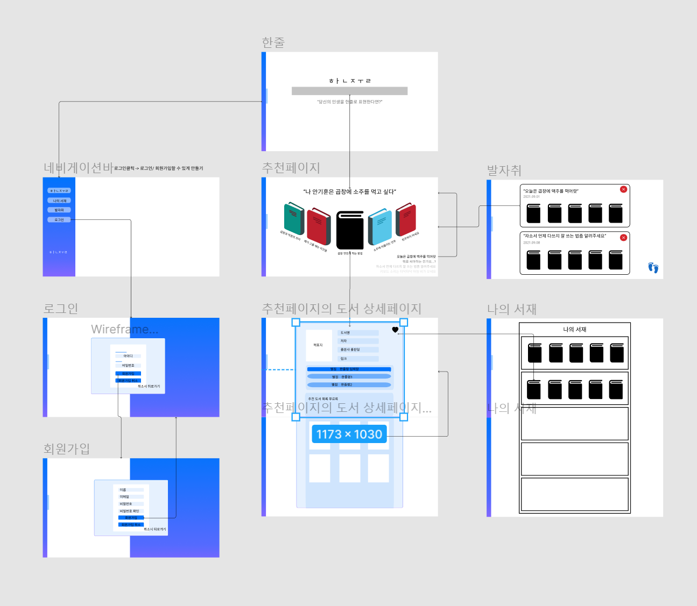

# 한 줄

> 2021.08.21 ~ 2021.10.08

**서비스 개요**

'한 줄'은 사용자의 한 문장을 받아 국립중앙도서관 도서 데이터를 기반으로 책을 추천해주는 서비스입니다.

**[서비스 바로가기](http://j5a301.p.ssafy.io/)**, **[유튜브](https://youtu.be/f_21cImpouk)**


 


## 목차

**[1. 기획](# 기획)**

**[2. 서비스 이미지](#서비스 이미지)**

**[3. 기술 스택](#기술 스택)**

**[4. 팀원 소개](#팀원 소개)**

**[5. Getting Started](#Getting Started)**

**[6. ETC](#ETC)**


## 기획

### 주제 선정

> [Google Jamboard](https://jamboard.google.com/d/1kRIxICsBSVMsb5uYEP9tDMYCeKyvlRgQcNkyqWhg9xE/viewer?f=1)


### 기획 배경

현대 사회에 무수히 많은 책이 존재하고, 정보의 호수 속에서 적절한 책을 찾는 일은 결코 쉬운일이 아닙니다. 이러한 물음에서 출발하여 사용자가 원하는 문장만 입력하면 유사한 책을 추천해주는 서비스를 개발하였습니다.


### 와이어프레임 및 프로토타입

> [Figma](https://www.figma.com/file/afEKV3pu1AIR3NbokgLfDk/Untitled?node-id=106%3A3)

* 와이어 프레임




* 프로토 타입


### API 설계

> [Swagger-ui]()


### 빅데이터

* CBF 알고리즘


## 서비스 이미지

* **메인 페이지**

책을 추천받기 위한 '한 줄'을 입력하는 페이지입니다.


* **'한 줄' 입력과 추천 페이지**

'한 줄'을 입력하면 컨텐츠 기반 필터링을 통해 국립중앙도서관 데이터 중 유사도가 높은 도서를 추천해줍니다.


* **추천 페이지**

우측 하단에서 다른 사용자들이 입력한 '한 줄'을 확인할 수 있습니다.
5권의 책이 추천되며, 원하는 책을 클릭해 상세 페이지로 이동할 수 있습니다.


* **도서 상세 페이지**

도서 즐겨찾기, 책과 연관된 도서, 책 리뷰를 확인할 수 있는 페이지입니다.


* **로그인/회원가입**

로그인과 회원가입 페이지를 한 곳에서 보여줄 수 있도록 제작했습니다.


* **나의 서재**

sidebar를 통해 나의 서재에 접근할 수 있습니다.
즐겨찾기된 책을 모아서 보여줍니다.


* **발자취**

'한줄' 페이지에서 검색했던 기록을 남겨 나중에 찾아볼 수 있도록 만들었습니다.


## 기술 스택


### 기술 표


### ERD


## 팀 구성 및 역할


## Getting Started

**Frontend**

```sh
cd hanjul/frontend
yarn install
yarn start
```

**Backend**

```sh
cd hanjul/backend
./gradlew build
cd build/libs
java -jar HANJUL-0.0.1-SNAPSHOT.jar
```

**Bigdata**

```sh
cd hanjul/bigdata
pip install django
pip install django djangorestframework
pip install mysqlclient
pip install django-cors-headers
pip install scikit-learn
pip install pandas

python manage.py makemigrations
python manage.py migrate
python manage.py runserver 0:8000
```


## ETC

* [Git Convention](./git_convention.md)

