# 📚Scenario

### 👨‍🎓시연 시나리오를 간략하게 설명드립니다.

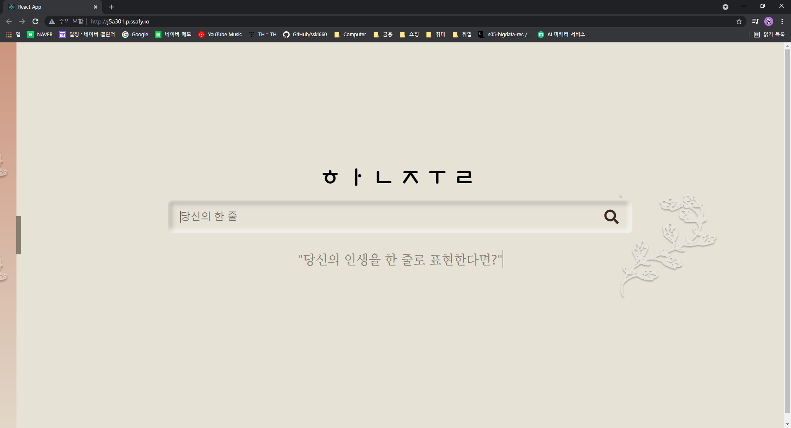

- 첫 페이지

  한 줄 문장을 입력하여 문장과 연관된 책을 추천받을 수 있는 페이지 입니다.

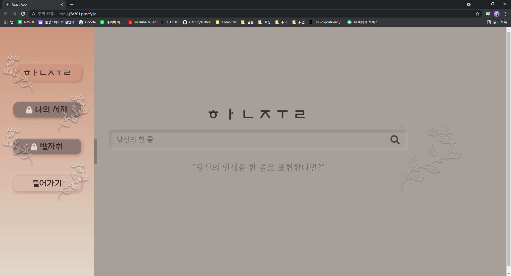

- 로그인을 하지 않는다면 다음과 같이 기능이 잠겨 있으므로, 로그인을 수행합니다.

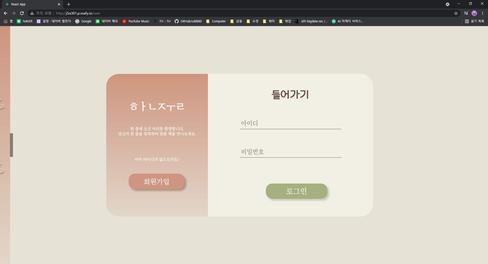

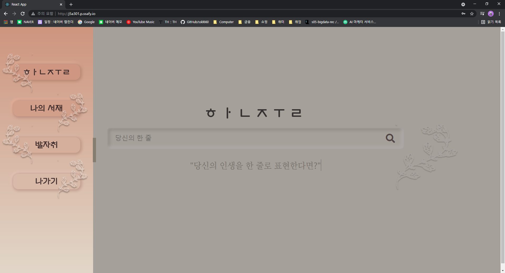

- 다음은 로그인 화면입니다. 로그인 및 회원 가입이 직접 구현한 JavaScript를 기반으로 유동적으로 움직이도록 구성하였습니다.
- 회원가입은 기본적인 비밀번호 확인만을 진행하여 간소화 하였습니다. 로그인을 진행하면 자물쇠가 걸려있던 기능이 해제 됩니다.

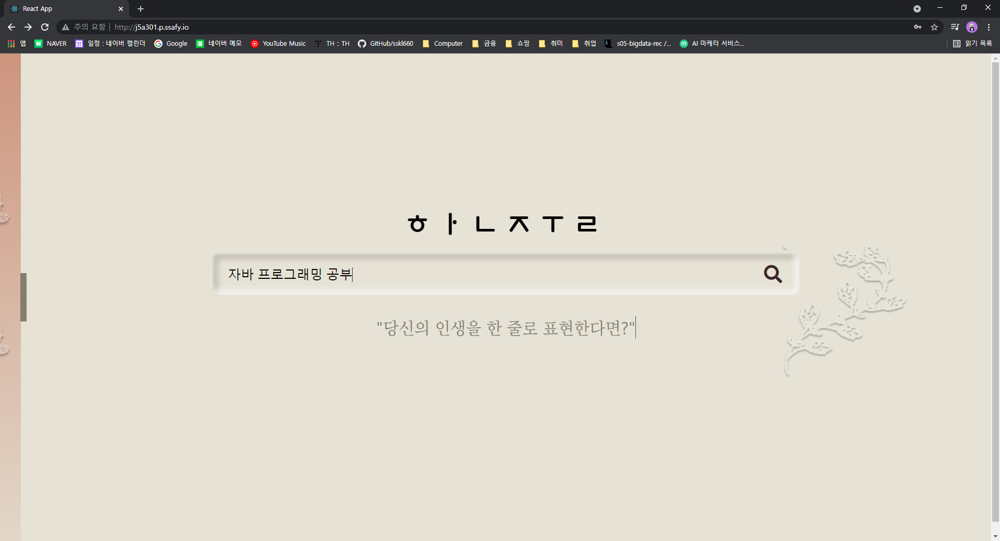

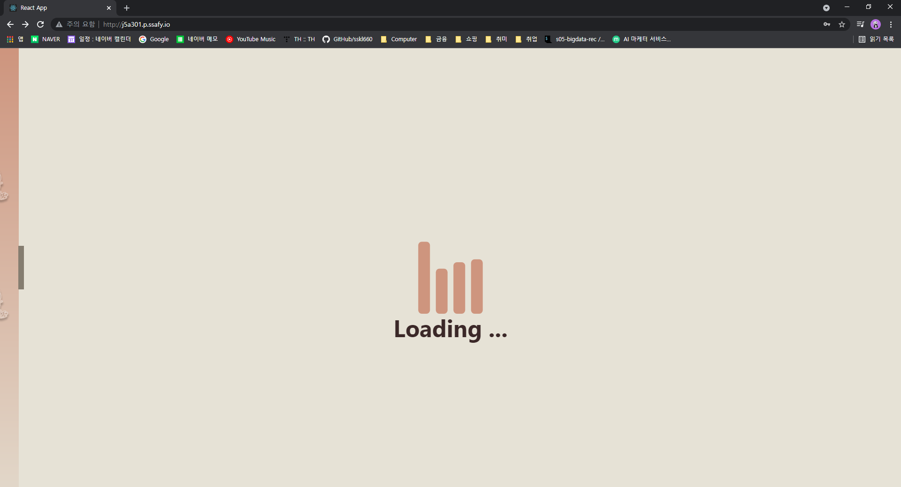

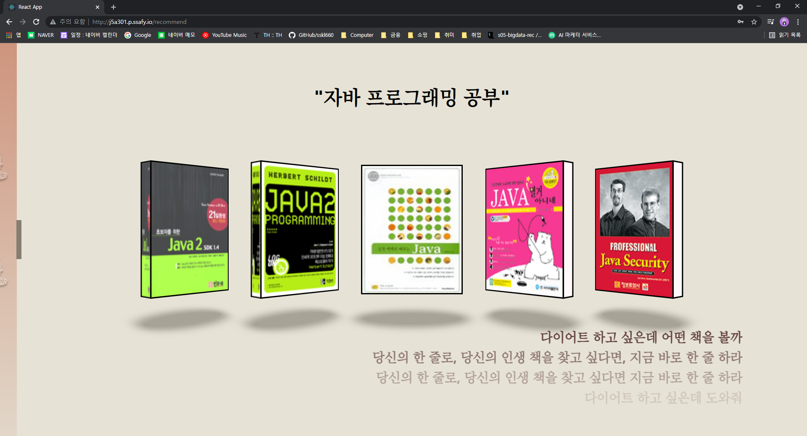

- 다음과 같이 한 줄 문장을 입력하면 잠시의 로딩 화면을 거친 후 결과를 출력합니다.
- 해당 문장을 적절히 분석하여, 빅데이터에 존재하는 책 설명(Description)을 기반으로 책의 내용을 분석하고, 이와 연관된 책을 상위 5개를 뽑아 추천해 줍니다.
- 책은 React를 사용하여 3차원 형태로 보일 수 있도록 가공하였습니다.
- 우측 하단에는 다른 사용자들이 어떤 검색을 하였는지 보여주는 역할을 수행합니다.
- 책을 클릭하면, 해당 책을 상세하게 확인할 수 있습니다. 이번에는 책을 클릭해 보겠습니다.

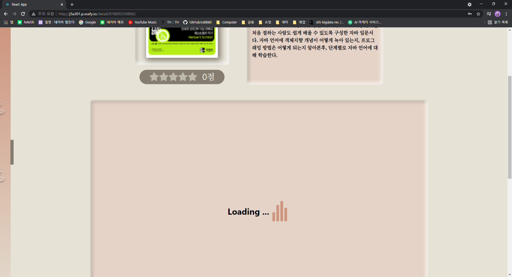

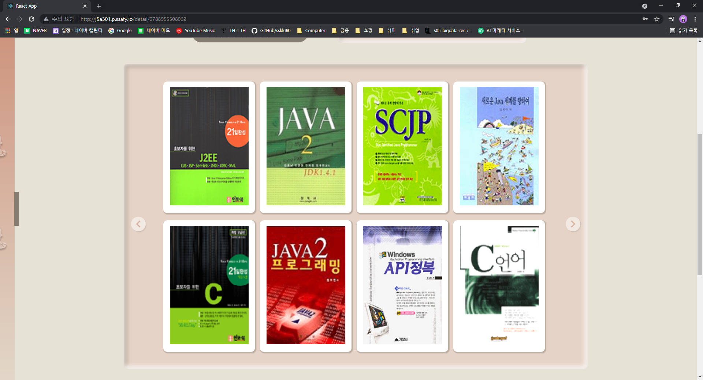

- 책을 클릭하면 다음과 같이 로딩이 진행된 후, 이 책과 연관된 책들을 또 추천해 줍니다.
- 해당 책들도 클릭을 하면, 해당 책들의 정보로 이동할 수 있습니다.

- 우상단의 북마크 표시를 누르면, 해당 책을 스크랩할 수 있습니다.
- 책 아래 별점은 사용자들의 별점의 총 합을 기반으로 산출됩니다.

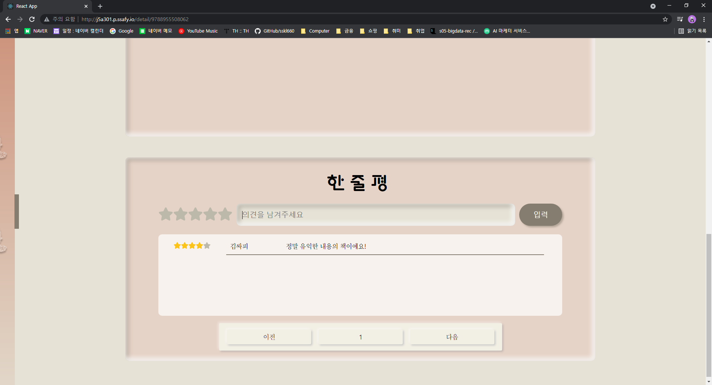

- 다음과 같이 해당 책에 리뷰를 남길 수 있습니다. 리뷰가 일정 개수 이상이 쌓이면, 해당 리뷰를 기반으로 CF 알고리즘을 적용하고 관련된 책들을 더욱 정밀하게 추천해줍니다.

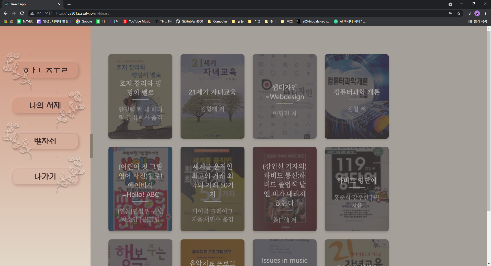

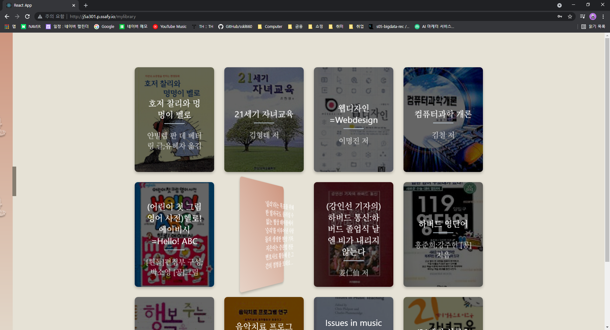

- 다음은 나의 서재입니다. 책 상세보기에서 스크랩 기능을 사용하면, 스크랩한 책의 내용은 나의 서재에 정리됩니다.
- 책을 마우스 오버하면, 책이 뒤집히며 간단한 책의 설명을 확인할 수 있습니다. 이 역시 React를 기반으로 구성하였습니다.
- 이 책들 역시 클릭하면, 책을 상세하게 볼 수 있는 페이지로 이동할 수 있습니다.

- 다음은 발자취 페이지입니다. 발자취는 본인이 검색했던 기록을 기반으로, 해당 책들을 간편하게 볼 수 있도록 정리한 페이지입니다.
- 발자취 기록은 우측 상단의 X표시를 클릭하여 삭제가 가능합니다.
- 또한, 발자취 기록을 클릭하면 해당 검색 페이지로 빠르게 이동할 수 있습니다.

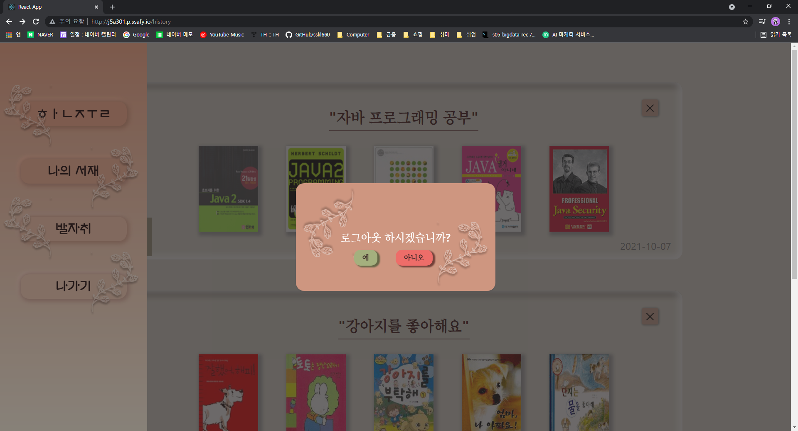

- 마지막으로 "나가기" 버튼을 클릭하고 로그아웃을 하면 해당 사이트에서 로그아웃을 할 수 있습니다.
